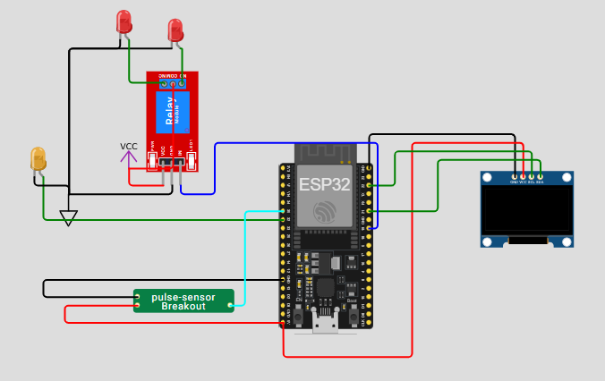
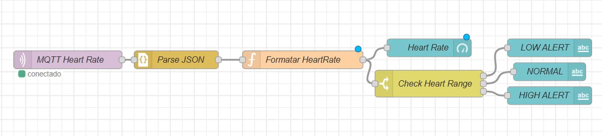
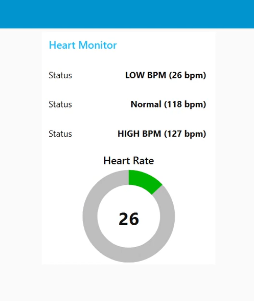

# SafeSpace

Este projeto consiste num sistema IoT para monitoramento de batimentos cardíacos de vítimas de desastres naturais, podendo ser utilizado remotamente para análise durante uma sessão psicológica ou para monitoramento de pacientes com riscos cardíacos. Utilizamos o Wokwi para prototipação, conexão com MQTT e um dashboard visual no Node-Red

## Explicações didáticas

### 1. Funcionamento do protótipo feito no Wokwi

O sensor de batimentos coleta os valores analógicos de pulsação da vítima, e o código da ESP32 converte os valores do sensor para uma frequência cardíaca em BPM.

### 2. Fluxo do Node-Red

O fluxo do Node-Red recebe os dados do batimento cardíaco via MQTT, realizando o recebimento dos dados e a classificação dos batimentos, dividido em baixo (LOW), normal, e alto (HIGH).

### 3. Dashboard do Node-Red

A visualização no dashboard é feita com um Gráfico Donut (Heart Rate), exibindo o valor atual em um gauge dividido em 3 possíveis cores:
- Verde: Normal
- Amarelo: Atenção
- Vermelho: Crítico

## Imagens ilustrativas

### Protótipo Wokwi



### Fluxo Node-Red



### Dashboard Node-Red



## Informações e instruções

Broker MQTT: broker.hivemq.com

Porta: 1883

Tópico: iot/esp32/heart

1. Abra o projeto no [Wokwi](https://wokwi.com/projects/432700227558135809) e execute.

2. Se não tiver o Node-Red instalado, instale-o utilizando:

```bash
npm install -g node-red
```

```bash
node-red
```

3. Após inicializar o Node-red, no canto superior direito, clique em importar, e importe o arquivo [flows](./flows.json) para o Node-Red.

4. Clique em implementar, para executar o fluxo.

5. Acesse o dashboard em http://localhost:1880/ui

## Grupo

- Felipe Levy Stephens Fidelix RM556426
- Jennifer Kaori Suzuki RM554661
- Samir Hage Neto RM557260